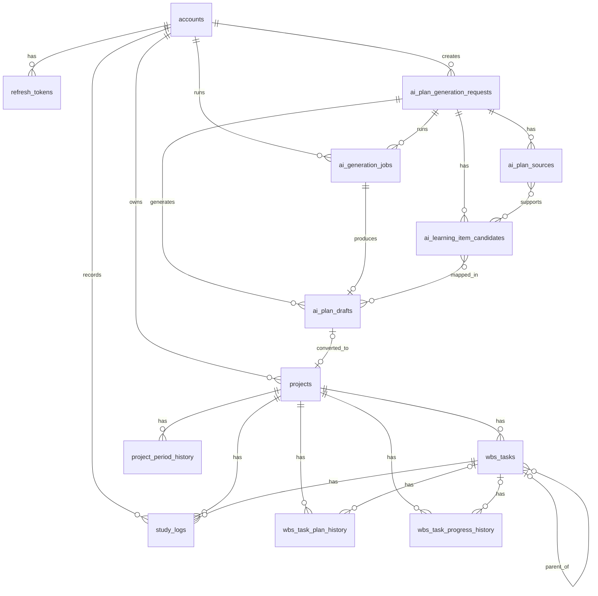

<!--
doc-type: 基本設計
id-prefix: なし
related: docs/requirements/details/data-screens-interfaces.md, docs/requirements/details/business-rules.md, docs/requirements/details/functional.md, docs/basic-design/tech-stack.md
-->

# データモデル

## 1. 目的

要件定義のデータ要件、業務ルール、機能要件をもとに、基本設計段階のエンティティとテーブル設計方針を定義する。

本書では詳細なカラム型、制約、インデックスまでは確定しない。Spring Data JPAとPostgreSQLで実装する前提で、実装者がエンティティの分け方、履歴の粒度、集計値の扱いを判断できる粒度まで整理する。

## 2. 前提

- 技術スタックは `docs/basic-design/tech-stack.md` に従う。
- 新しいID体系は原則追加しない。エンティティとテーブルは `accounts`, `projects`, `wbs_tasks` などのテーブル名で識別する。
- テーブル名は目的駆動名前設計を優先し、存在そのものではなく業務上の役割が分かる名前を使う。
- 履歴テーブルは監査ログではなく、要件上必要な「期間変更」「計画変更」「進捗変更」を保持するための業務データとして扱う。
- テーブル名は複数形（`accounts`, `projects` 等）を基本とするが、履歴テーブルは `history` を不可算名詞として扱い、`project_period_history` のように単数形のまま用いる。
- Mermaid ER図は概念ERとし、全カラム網羅ではなく主要キーと主要関連に絞る。
- AI学習計画生成はMVP3対象のため、AI関連テーブルはMVP1・MVP2では作成しない。

## 3. 決定方針

| 論点 | 決定 | 根拠 |
| --- | --- | --- |
| エンティティ | `Account`, `Project`, `ProjectPeriodHistory`, `WbsTask`, `WbsTaskPlanHistory`, `WbsTaskProgressHistory`, `StudyLog`, `AiPlanGenerationRequest`, `AiPlanSource`, `AiLearningItemCandidate`, `AiGenerationJob`, `AiPlanDraft` を採用する | 15章の主要データを過不足なく表現できる。AI関連はMVP3に分離する |
| 親タスク／タスク | `wbs_tasks` 単一テーブル + `parent_wbs_task_id` self-join とする | 親タスクとタスクは同じWBS内で並び、親なしタスクも存在するため、単一テーブルの方が画面構造と整合する |
| 履歴粒度 | 変更イベント1回につき1行追加する。同一値保存では追加しない | 10.5の進捗履歴ルールと、10.4/10.5の履歴保持方針に合わせる |
| 集計値 | 実績工数、予定工数合計、進捗率、連続学習日数、EVM、バーンダウンは原則保存せず都度計算する | 学習記録や過去日入力の変更で再計算が必要になるため、保存すると整合性維持コストが高い |
| MVP境界 | 履歴系はMVP1から保存する。EVM・バーンダウンの表示はMVP2、AI計画関連はMVP3 | `scope.md` 6.3の段階リリースに従う |

## 4. エンティティ一覧

### 4.1 Account

ログインアカウントを表す。MVP1ではメールアドレス・パスワード認証のみを扱う。

| 項目 | 方針 |
| --- | --- |
| テーブル名 | `accounts` |
| 主なカラム | `id`, `email`, `password_hash`, `display_name`, `created_at`, `updated_at` |
| 主キー | `id` |
| 主な制約 | `email` は大文字小文字を区別せず一意。パスワードは平文保存しない |
| MVP | MVP1 |

現行スキーマと `Account` エンティティには先行実装された `ai_usage_consent_at` / `aiUsageConsentAt` が存在するが、MVP3では同意状態を永続管理しないため使用しない。JavaフィールドとDBカラムをMVP3の同じ変更で削除する。

### 4.2 RefreshToken

アクセストークン再発行に使うリフレッシュトークンを表す。MVP1ではログアウト時の失効管理を目的として保持する。

| 項目 | 方針 |
| --- | --- |
| テーブル名 | `refresh_tokens` |
| 主なカラム | `id`, `account_id`, `token_hash`, `expires_at`, `revoked_at`, `created_at` |
| 主キー | `id` |
| 外部キー | `account_id` -> `accounts.id` |
| 主な制約 | リフレッシュトークンは平文保存せず、ハッシュ化して保存する。`revoked_at` が設定済み、または `expires_at` を過ぎたトークンは再発行に使えない |
| MVP | MVP1 |

MVP1ではリフレッシュトークンのローテーション、再利用検知、デバイス一覧、全端末強制ログアウトは扱わない。これらが必要になった場合は、`replaced_by_token_id`, `last_used_at`, `user_agent`, `ip_address` などの追加カラムを検討する。

### 4.3 Project

学習プロジェクトを表す。プロジェクト状態はユーザー操作で保持するが、完了への変更時は業務ルールで検証する。

| 項目 | 方針 |
| --- | --- |
| テーブル名 | `projects` |
| 主なカラム | `id`, `account_id`, `name`, `description`, `start_date`, `target_end_date`, `status`, `created_at`, `updated_at` |
| 主キー | `id` |
| 外部キー | `account_id` -> `accounts.id` |
| 保存しない集計値 | 予定工数合計、実績工数合計、進捗率、遅延有無、EVM指標 |
| MVP | MVP1 |

プロジェクトは削除APIで削除する。削除時は、対象プロジェクト配下のWBSタスク、学習記録、履歴も削除対象とする。

### 4.4 ProjectPeriodHistory

プロジェクト開始日または目標終了日の変更履歴を表す。

| 項目 | 方針 |
| --- | --- |
| テーブル名 | `project_period_history` |
| 主なカラム | `id`, `project_id`, `old_start_date`, `new_start_date`, `old_target_end_date`, `new_target_end_date`, `changed_by_account_id`, `changed_at` |
| 主キー | `id` |
| 外部キー | `project_id` -> `projects.id`, `changed_by_account_id` -> `accounts.id` |
| 追加条件 | `start_date` または `target_end_date` の保存前後の値が変わった場合に1行追加する |
| MVP | MVP1 |

新規作成時は変更前の値が存在しないため、期間履歴は追加しない。開始日だけ、または目標終了日だけが変わった場合も、変更イベント1回として変更前後の両方の期間を1行へ保存する。

### 4.5 WbsTask

WBS上の親タスクとタスクを表す。親タスクとタスクは単一テーブルで管理し、`task_type` と `parent_wbs_task_id` で区別する。

| 項目 | 方針 |
| --- | --- |
| テーブル名 | `wbs_tasks` |
| 主なカラム | `id`, `project_id`, `parent_wbs_task_id`, `task_type`, `name`, `description`, `planned_start_date`, `planned_end_date`, `planned_hours`, `progress_rate`, `created_at`, `updated_at` |
| 主キー | `id` |
| 外部キー | `project_id` -> `projects.id`, `parent_wbs_task_id` -> `wbs_tasks.id` |
| 親タスク | `task_type = PARENT`。`parent_wbs_task_id`, `planned_start_date`, `planned_end_date`, `planned_hours`, `progress_rate` は持たない |
| タスク | `task_type = LEAF`。`parent_wbs_task_id` は任意。`planned_hours`, `progress_rate` は必須。予定日は任意 |
| MVP | MVP1 |

`LEAF` は用語定義上のリーフタスク、つまり実際に学習する「タスク」を表す。`PARENT` と `LEAF` の2種類に限定し、3階層以上は作らない。

表示順は原則として保存しない。10.3の並び順ルールに従い、予定日と作成日時からクエリまたはサービス層で算出する。将来、手動並び替えを追加する場合のみ `sort_order` などの永続カラムを検討する。

### 4.6 WbsTaskPlanHistory

タスクの計画情報の変更履歴を表す。

| 項目 | 方針 |
| --- | --- |
| テーブル名 | `wbs_task_plan_history` |
| 主なカラム | `id`, `wbs_task_id`, `project_id`, `task_name_snapshot`, `old_parent_wbs_task_id`, `new_parent_wbs_task_id`, `old_planned_start_date`, `new_planned_start_date`, `old_planned_end_date`, `new_planned_end_date`, `old_planned_hours`, `new_planned_hours`, `changed_by_account_id`, `changed_at` |
| 主キー | `id` |
| 外部キー | `wbs_task_id` -> `wbs_tasks.id`（削除時はNULL）、`project_id` -> `projects.id`、`changed_by_account_id` -> `accounts.id` |
| 追加条件 | タスクの `parent_wbs_task_id`, `planned_start_date`, `planned_end_date`, `planned_hours` のいずれかが変わった場合に1行追加する |
| MVP | MVP1 |

名称と説明の変更は計画履歴に含めない。親タスクは予定日、予定工数、進捗率を持たないため、親タスク自身の編集では計画履歴を追加しない。タスクを親タスク配下または親なしへ移動した場合は、対象タスクの計画履歴として保存する。
タスク削除後も履歴を保持するため、変更時点のタスク名を `task_name_snapshot` に保存し、`project_id` で帰属プロジェクトを保持する。親タスク削除時は `old_parent_wbs_task_id` / `new_parent_wbs_task_id` がNULLになり、移動元・移動先の親タスクを履歴から追跡することは保証しない。

### 4.7 WbsTaskProgressHistory

タスクの進捗率変更履歴を表す。

| 項目 | 方針 |
| --- | --- |
| テーブル名 | `wbs_task_progress_history` |
| 主なカラム | `id`, `wbs_task_id`, `project_id`, `task_name_snapshot`, `progress_rate`, `changed_by_account_id`, `changed_at` |
| 主キー | `id` |
| 外部キー | `wbs_task_id` -> `wbs_tasks.id`（削除時はNULL）、`project_id` -> `projects.id`、`changed_by_account_id` -> `accounts.id` |
| 追加条件 | タスク作成時に0%を1行追加する。以降は保存前後の進捗率が変わった場合だけ1行追加する |
| MVP | MVP1 |

同日に複数回変更した場合もすべて保持する。日別EVやバーンダウン実績線では、JST各日終了時点までの最新行を採用する。親タスクは進捗率を持たないため、進捗履歴も持たない。
タスク削除後も履歴を保持するため、変更時点のタスク名を `task_name_snapshot` に保存し、`project_id` で帰属プロジェクトを保持する。

### 4.8 StudyLog

学習記録を表す。学習記録は実績工数、AC、連続学習日数、総学習時間の算出元になる。

| 項目 | 方針 |
| --- | --- |
| テーブル名 | `study_logs` |
| 主なカラム | `id`, `account_id`, `project_id`, `wbs_task_id`, `study_date`, `study_hours`, `memo`, `created_at`, `updated_at` |
| 主キー | `id` |
| 外部キー | `account_id` -> `accounts.id`, `project_id` -> `projects.id`, `wbs_task_id` -> `wbs_tasks.id` |
| 主な制約 | `wbs_task_id` は `task_type = LEAF` のみ許可する。未来日の `study_date` は許可しない |
| MVP | MVP1 |

`project_id` と `account_id` は `wbs_task_id` から辿れるが、プロジェクト単位・アカウント単位の集計と所有者判定を簡潔にするため保持する。登録・更新時には、指定タスクが同じプロジェクト・同じアカウントに属することをサービス層で検証する。タスクは別プロジェクトへ移動できないため、保存後の整合性は保ちやすい。

### 4.9 AiPlanGenerationRequest

AI学習計画生成の入力と候補一覧の確認版を表す。MVP3で作成する。

| 項目 | 方針 |
| --- | --- |
| テーブル名 | `ai_plan_generation_requests` |
| 主なカラム | `id`, `account_id`, `source_type`, `learning_goal`, `start_date`, `target_end_date`, `constraints_json`, `candidate_revision`, `confirmed_candidate_revision`, `confirmed_at`, `created_at`, `updated_at` |
| 主キー | `id` |
| 外部キー | `account_id` -> `accounts.id` |
| MVP | MVP3 |

`constraints_json` には学習可能時間、学習できない曜日、日程補足、重点範囲、軽く確認する範囲、除外範囲、AIが構造化してユーザーが確認する数量条件などを保持する。概要、教材名、直接入力目次、修正済みOCR結果は重複保持せず、複数教材・複数画像を表現できる `ai_plan_sources` に保存する。候補一覧または数量条件の変更時に `candidate_revision` を進め、`confirmed_candidate_revision` と一致する場合だけ現在の候補一覧と数量条件を確認済みと扱う。教材画像ファイルは永続保存しない。

### 4.10 AiPlanSource

候補抽出に利用した入力元を表す。概要、直接入力目次、OCR画像ごとの修正済みテキストを区別する。

| 項目 | 方針 |
| --- | --- |
| テーブル名 | `ai_plan_sources` |
| 主なカラム | `id`, `ai_plan_generation_request_id`, `temporary_key`, `source_type`, `source_order`, `label`, `text_content`, `content_hash`, `created_at`, `updated_at` |
| 主キー | `id` |
| 外部キー | `ai_plan_generation_request_id` -> `ai_plan_generation_requests.id` |
| MVP | MVP3 |

画像そのものは保存せず、OCR後にユーザーが修正したテキストだけを入力元として保持する。`temporary_key` はOpenAIの候補抽出結果と入力元を対応付けるために使用し、業務DBのUUIDは送信しない。`source_order` は複数教材・複数画像の順序を維持する。

### 4.11 AiLearningItemCandidate

WBS生成前にユーザーが確認する学習項目候補を表す。

| 項目 | 方針 |
| --- | --- |
| テーブル名 | `ai_learning_item_candidates` |
| 主なカラム | `id`, `ai_plan_generation_request_id`, `temporary_key`, `name`, `description`, `origin_type`, `priority`, `display_order`, `candidate_revision`, `created_at`, `updated_at` |
| 主キー | `id` |
| 外部キー | `ai_plan_generation_request_id` -> `ai_plan_generation_requests.id` |
| 主な制約 | `origin_type` は `INPUT_DERIVED` / `AI_SUPPLEMENTED`、`priority` は `FOCUS` / `NORMAL` / `LIGHT` / `EXCLUDED` |
| MVP | MVP3 |

入力元と候補は多対多とし、`ai_learning_item_candidate_sources` で対応を保持する。候補一覧の更新は、候補行とリクエストのrevisionを同一トランザクションで更新する。

### 4.12 AiGenerationJob

学習項目候補抽出とWBS下書き生成の非同期実行を表す。

| 項目 | 方針 |
| --- | --- |
| テーブル名 | `ai_generation_jobs` |
| 主なカラム | `id`, `ai_plan_generation_request_id`, `account_id`, `job_type`, `status`, `deadline_at`, `attempt_count`, `schema_regeneration_count`, `error_code`, `provider_request_id`, `model_name`, `prompt_version`, `schema_version`, `strategy_version`, `input_tokens`, `output_tokens`, `started_at`, `completed_at`, `created_at`, `updated_at` |
| 主キー | `id` |
| 外部キー | `ai_plan_generation_request_id` -> `ai_plan_generation_requests.id`, `account_id` -> `accounts.id` |
| 主な制約 | `job_type` は `LEARNING_ITEM_EXTRACTION` / `WBS_GENERATION`。同一アカウントのactive状態は1件だけ |
| MVP | MVP3 |

active状態は `QUEUED`, `PROCESSING`, `CANCEL_REQUESTED`、terminal状態は `COMPLETED`, `FAILED`, `CANCELED` とする。外部サービスへ送信した本文は保持せず、品質・費用比較に必要な版情報と利用量だけを保持する。

### 4.13 AiPlanDraft

AIが生成し、サーバー検証を通過した保存前のWBS下書きを表す。MVP3で作成する。

| 項目 | 方針 |
| --- | --- |
| テーブル名 | `ai_plan_drafts` |
| 主なカラム | `id`, `ai_plan_generation_request_id`, `ai_generation_job_id`, `account_id`, `revision`, `project_name`, `project_description`, `start_date`, `target_end_date`, `draft_wbs_tasks_json`, `validation_status`, `warnings_json`, `relaxation_options_json`, `converted_project_id`, `converted_at`, `created_at`, `updated_at` |
| 主キー | `id` |
| 外部キー | `ai_plan_generation_request_id` -> `ai_plan_generation_requests.id`, `ai_generation_job_id` -> `ai_generation_jobs.id`, `account_id` -> `accounts.id`, `converted_project_id` -> `projects.id` |
| MVP | MVP3 |

下書き内の各タスクには一時キーを付け、学習項目候補との多対多対応を `ai_draft_task_candidate_links` に保持する。ユーザーが確認して保存した時点で、`projects` と `wbs_tasks` へ正規化して登録する。保存後のプロジェクトとWBSは通常のプロジェクト・タスクとして扱い、AI由来かどうかに依存した特別な制約や候補対応を持たせない。

1つのAI計画案から作成できるプロジェクトは1件のみとする。`converted_project_id` は未保存時は未設定、保存後は一意とし、同じ計画案から重複作成しない。

## 5. 親タスク／タスクのテーブル設計比較

| 案 | 内容 | 評価 |
| --- | --- | --- |
| 単一テーブル + self-join | `wbs_tasks` に親タスクとタスクを保存し、`task_type` と `parent_wbs_task_id` で区別する | 採用。WBS画面、親なしタスク、親変更、履歴、学習記録との関連を1つのモデルで扱える |
| テーブル分離 | 親タスク用の `wbs_parent_tasks` と学習タスク用の `wbs_learning_tasks` を分ける | 却下。WBS一覧でUNIONが必要になり、親なしタスクや親変更、削除確認、履歴管理の実装が複雑になる |

単一テーブル案では、DB制約とサービス層で次のルールを守る。

- 親タスクは最上位のみ。`task_type = PARENT` の行は `parent_wbs_task_id` を持たない。
- リーフタスクは親タスク配下または親なしの最上位のみ。`parent_wbs_task_id` を設定する場合、参照先は同一プロジェクトの `task_type = PARENT` に限る。
- タスク配下にタスクを作れない。3階層以上と循環参照を許可しない。
- 親タスクには学習記録を登録できない。
- 親タスクとタスクを別プロジェクトへ移動できない。

## 6. 履歴テーブルの粒度

| 履歴 | 追加タイミング | 1行に保存する内容 | 追加しないケース |
| --- | --- | --- | --- |
| `project_period_history` | プロジェクト開始日または目標終了日を変更して保存したとき | 変更前後の開始日、変更前後の目標終了日、変更者、変更日時 | 新規作成時、保存前後の期間が同一の場合 |
| `wbs_task_plan_history` | タスクの親タスク、開始予定日、終了予定日、予定工数のいずれかを変更して保存したとき | 変更前後の親タスク、予定日、予定工数、変更者、変更日時 | 名称・説明のみの変更、親タスク自身の編集、保存前後の計画値が同一の場合 |
| `wbs_task_progress_history` | タスク作成時、または進捗率を変更して保存したとき | 変更後の進捗率、変更者、変更日時 | 親タスク、保存前後の進捗率が同一の場合 |

進捗履歴は「1回の変更イベント=1行」とし、同日複数回の変更もすべて保存する。タスク作成時の初期0%行は、変更前の値を持たない初期進捗値の記録として同じテーブルで扱う。日別EVやバーンダウン実績線の計算では、対象日のJST終了時点までに保存された最新の進捗率を採用する。

## 7. 集計値の保存方針

| 値 | 保存方針 | 算出元・再計算方針 |
| --- | --- | --- |
| タスク状態 | 保存しない | `wbs_tasks.progress_rate` から未着手・進行中・完了を都度判定する |
| タスク実績工数 | 保存しない | `study_logs` の対象タスク合計から都度計算する |
| プロジェクト予定工数 | 保存しない | 親タスクを除く `wbs_tasks.planned_hours` の合計から都度計算する |
| プロジェクト実績工数 | 保存しない | 対象プロジェクトの `study_logs.study_hours` 合計から都度計算する |
| プロジェクト進捗率 | 保存しない | `sum(planned_hours * progress_rate) / sum(planned_hours)` を親タスク以外で計算する。計算対象タスクが0件の場合は未算出とする |
| 残予定工数 | 保存しない | `予定工数合計 - EV` を都度計算する |
| 遅延有無 | 保存しない | `planned_end_date < 基準日` かつ `progress_rate < 100` のタスク有無で判定する |
| 総学習時間 | 保存しない | アカウント単位の `study_logs.study_hours` 合計から都度計算する |
| 連続学習日数 | 保存しない | アカウント単位またはプロジェクト単位で `study_logs.study_date` を集計して都度計算する |
| EVM指標 | 保存しない | `wbs_tasks`, `study_logs`, `wbs_task_progress_history` からMVP2で都度計算する |
| バーンダウン表示点 | 保存しない | 現在有効な計画値と進捗履歴からMVP2で都度計算する |

MVP時点では集計キャッシュやサマリーテーブルは作らない。性能上必要になった場合のみ、読み取り専用の集計キャッシュを追加する。その場合の再計算トリガーは、`wbs_tasks`, `wbs_task_plan_history`, `wbs_task_progress_history`, `study_logs`, `projects` の変更イベントに限定する。

## 8. 概念ER図

エンティティ間の関連のみを示す。各エンティティの主要カラム、主キー、外部キーは「4. エンティティ一覧」を参照する。

- `wbs_tasks` の自己参照は、リーフタスクから親タスクへの参照（`parent_wbs_task_id`）を表す。
- `ai_plan_drafts` と `projects` は、保存済みの計画案だけが1件のプロジェクトへ変換される0..1対0..1の関係とする（`converted_project_id`）。
- `ai_plan_drafts` は `account_id` も保持するが、`ai_plan_generation_requests` 経由で辿れるため図では省略する。

## 9. MVP別テーブル作成一覧

| テーブル | エンティティ | 作成MVP | 備考 |
| --- | --- | --- | --- |
| `accounts` | Account | MVP1 | 認証とアカウント所有データの起点 |
| `refresh_tokens` | RefreshToken | MVP1 | JWTリフレッシュトークンの失効管理 |
| `projects` | Project | MVP1 | 不要なプロジェクトは削除できる |
| `project_period_history` | ProjectPeriodHistory | MVP1 | MVP1から保存するが、履歴一覧表示はしない |
| `wbs_tasks` | WbsTask | MVP1 | 親タスクとタスクを単一テーブルで扱う |
| `wbs_task_plan_history` | WbsTaskPlanHistory | MVP1 | MVP1から保存するが、MVP2のEVM・バーンダウン計算には使わない |
| `wbs_task_progress_history` | WbsTaskProgressHistory | MVP1 | MVP2の日別EV、バーンダウン実績線で利用する |
| `study_logs` | StudyLog | MVP1 | 実績工数、AC、連続学習日数の算出元 |
| `ai_plan_generation_requests` | AiPlanGenerationRequest | MVP3 | AI作成条件、OCR結果、目次テキスト、こだわり条件を保持 |
| `ai_plan_sources` | AiPlanSource | MVP3 | 候補抽出に利用した概要・目次・修正済みOCRテキストを保持 |
| `ai_learning_item_candidates` | AiLearningItemCandidate | MVP3 | WBS生成前に確認する学習項目候補を保持 |
| `ai_learning_item_candidate_sources` | CandidateSourceLink | MVP3 | 入力元と学習項目候補の多対多対応を保持 |
| `ai_generation_jobs` | AiGenerationJob | MVP3 | 候補抽出・WBS生成の状態、期限、版、利用量を保持 |
| `ai_plan_drafts` | AiPlanDraft | MVP3 | 検証済みWBS下書き、警告、緩和案をJSONBで保持 |
| `ai_draft_task_candidate_links` | DraftTaskCandidateLink | MVP3 | 下書きタスクの一時キーと学習項目候補の多対多対応を保持 |

MVP2では新規テーブルを追加せず、MVP1から保存している履歴テーブルを利用して進捗分析を提供する。

## 10. 要件との対応

| 要件 | 対応 |
| --- | --- |
| 15章 データ要件 | 主要データをエンティティ一覧へ対応付けた |
| 17.1 最終MVPのAPI利用 | `accounts`, `refresh_tokens` によりJWT認証とリフレッシュトークン失効管理に対応 |
| 10.3 WBS階層と集計 | `wbs_tasks` 単一テーブル + self-join、親タスク除外集計で対応 |
| 10.4 予定日とプロジェクト期間 | `project_period_history` と計画不整合判定で対応 |
| 10.5 進捗率と履歴 | `wbs_task_progress_history` を変更イベント単位で保存 |
| 10.6 工数と学習記録 | `study_logs` を実績工数・AC・学習サマリーの算出元にする |
| 10.8 EVM計算ルール | `wbs_tasks`, `study_logs`, `wbs_task_progress_history` から都度計算 |
| 10.9 バーンダウン計算ルール | 現在有効な計画値と進捗履歴から都度計算 |
| 10.10 AI学習計画生成 | 入力、入力元、学習項目候補、非同期ジョブ、WBS下書きをMVP3の独立データとして追加 |

## 11. 独自判断・未決事項

| 項目 | 判断・未決事項 |
| --- | --- |
| 過去日の学習記録編集期限 | MVP1では期限なしで編集・削除可能とする。データモデル上も編集可能期間を制限するカラムは持たない |
| StudyLogの `account_id` / `project_id` | 集計と所有者判定のため、`wbs_task_id` から辿れる情報を保持する。整合性は登録・更新時のサービス層検証で担保する |
| WBS表示順 | 永続カラムは持たず、予定日と作成日時から算出する。手動並び替えが追加される場合だけ再検討する |
| AI教材画像 | 一時データとして扱い、永続保存しない。画像順とOCR後の修正済みテキストは `ai_plan_sources` で保持する |
| AI下書きの正規化 | MVP3では `draft_wbs_tasks_json` に保持し、タスク一時キーと候補の対応だけを別テーブルにする。長期保存や詳細な差分監査が必要になった場合だけ下書きタスクの正規化を再検討する |
| `ai_usage_consent_at` | 現行スキーマと `Account.aiUsageConsentAt` に存在するがMVP3では利用しない。JavaフィールドとDBカラムをMVP3の同じ変更で削除する |
| リフレッシュトークンの詳細 | `refresh_tokens` はMVP1で作成する。トークン有効期限、Cookie属性、PC WebとFlutterでの受け渡し差分、ローテーションを将来追加するかはAPI詳細設計で決定する |
