<!--
doc-type: 基本設計
id-prefix: AU, PJ, WB, SL, AN, AI, CM, SCR
related: docs/basic-design/screen-list.md, docs/requirements/details/data-screens-interfaces.md, docs/basic-design/tech-stack.md
-->

# 画面遷移図

## 1. 目的

画面間の遷移を定義し、ルーティング設計とナビゲーション設計の基準とする。

- 画面IDと画面名は `docs/basic-design/screen-list.md` に従う。
- 遷移の根拠となる画面要件は `docs/requirements/details/data-screens-interfaces.md` 16章を参照する。
- UIモックのサイドバー（全画面切り替え）は要件検証用のため、本遷移図には含めない。

## 2. 全体遷移図

```mermaid
flowchart LR
    subgraph auth["認証"]
        AU01["AU01<br>アカウント登録"]
        AU02["AU02<br>ログイン"]
    end

    subgraph home["ホーム"]
        PJ01["PJ01<br>プロジェクト一覧"]
    end

    subgraph create["プロジェクト作成フロー"]
        PJ02["PJ02<br>プロジェクト作成・編集"]
        AI01["AI01<br>AI計画 方法選択<br>MVP3"]
        AI02["AI02<br>AI計画 条件・教材入力<br>MVP3"]
        AI03["AI03<br>学習項目候補確認<br>MVP3"]
        AI04["AI04<br>WBS下書き確認<br>MVP3"]
    end

    subgraph workspace["プロジェクト内ワークスペース"]
        CM02["CM02<br>プロジェクト内タブ"]
        PJ03["PJ03<br>プロジェクト概要"]
        WB01["WB01<br>WBS・ガント"]
        SL01["SL01<br>学習記録"]
        AN01["AN01<br>進捗分析<br>MVP2"]
    end

    AU01 -- 登録して開始 --> PJ01
    AU01 -- ログインへ戻る --> AU02
    AU02 -- ログイン成功 --> PJ01
    AU02 -- アカウントを作成する --> AU01

    PJ01 -- 新規作成: 手動で作成 --> PJ02
    PJ01 -. 新規作成: AIと作成 MVP3 .-> AI01
    PJ01 -- プロジェクト行を選択 --> CM02
    PJ01 -- 既存プロジェクトの編集 --> PJ02

    PJ02 -- 新規作成: 保存 --> CM02
    PJ02 -- 新規作成: キャンセル --> PJ01
    PJ02 -- 編集: 保存・キャンセル --> CM02

    AI01 -. 作成方法を選択 .-> AI02
    AI01 -. プロジェクト一覧へ戻る .-> PJ01
    AI02 -. 学習項目候補を抽出 .-> AI03
    AI02 -. 作成方法へ戻る .-> AI01
    AI03 -. 確認済み候補からWBSを生成 .-> AI04
    AI03 -. 条件・教材を変更 .-> AI02
    AI04 -. この計画でプロジェクトを作成 .-> CM02
    AI04 -. 候補を変更 .-> AI03
    AI04 -. 条件を変更 .-> AI02

    CM02 -- 概要タブ --> PJ03
    CM02 -- WBSタブ --> WB01
    CM02 -- 学習記録タブ --> SL01
    CM02 -. 進捗分析タブ MVP2 .-> AN01
    CM02 -- 状態バッジ: 状態変更を保存 --> CM02
    PJ03 ~~~ WB01
    WB01 ~~~ SL01
    SL01 ~~~ AN01

    PJ03 -- プロジェクト編集 --> PJ02
    CM02 -- プロジェクト一覧へ戻る --> PJ01
```

CM02はプロジェクト内タブを表す図上のハブであり、独立した画面ではない。CM02からPJ03、WB01、SL01、AN01へ並列に切り替える。

ログイン後の全画面からログアウト（CM01アプリヘッダー）でAU02へ遷移できる。図の簡略化のため矢印は省略する。

## 3. 遷移一覧

| No | 遷移元 | 遷移先 | トリガー | 根拠・備考 |
| --- | --- | --- | --- | --- |
| 1 | AU01 | PJ01 | 登録して開始 | 登録成功後はログイン済み状態でホームへ |
| 2 | AU01 | AU02 | ログインへ戻る | |
| 3 | AU02 | PJ01 | ログイン成功 | PJ01はログイン後の初期画面（16.1） |
| 4 | AU02 | AU01 | アカウントを作成する | |
| 5 | PJ01 | PJ02 | 新規作成 → 手動で作成 | SCR.PJ01-12。新規作成で手動/AIを選択 |
| 6 | PJ01 | AI01 | 新規作成 → AIと作成 | MVP3。SCR.PJ01-12 |
| 7 | PJ01 | PJ03 | プロジェクト行を選択 | SCR.PJ01-06。図ではプロジェクト内タブのハブであるCM02を経由して表現する |
| 8 | PJ01 / PJ03 | PJ02 | 既存プロジェクトの編集 | SCR.PJ01-06、SCR.PJ03-04。編集モードで開く |
| 9 | PJ02 | PJ03 | 新規作成モードで保存 | SCR.PJ02-09。作成直後はWBSタスク0件。図ではCM02を経由して表現する |
| 10 | PJ02 | PJ01 | 新規作成モードでキャンセル | |
| 10A | PJ02 | PJ03 | 編集モードで保存・キャンセル | 編集元のプロジェクト概要へ戻る。図ではCM02を経由して表現する |
| 11 | AI01 | AI02 | 概要から作成 / 目次から作成を選択 | MVP3。選択した方法をAI02へ引き継ぐ |
| 12 | AI01 | PJ01 | プロジェクト一覧へ戻る | |
| 13 | AI02 | AI03 | 学習項目候補を抽出 | MVP3。必須入力と入力矛盾の事前検証を満たした場合のみ有効 |
| 14 | AI02 | AI01 | 作成方法へ戻る | 入力内容の保持は基本設計で決定 |
| 15 | AI03 | AI04 | WBS下書きを生成 | 現在の候補一覧が確認済みで、除外されていない候補が1件以上ある場合のみ有効 |
| 16 | AI03 | AI02 | 条件・教材を変更 | 入力内容を保持したまま戻る。候補の再抽出後は新しい候補一覧を確認する |
| 16A | AI04 | WB01 | この計画でプロジェクトを作成 | MVP3。再検証と変換に成功後、作成されたプロジェクトのWBSへ。図ではCM02を経由して表現する |
| 16B | AI04 | AI03 | 学習項目候補を変更 | 候補一覧を保持したまま戻る。変更後は再確認とWBS再生成が必要 |
| 16C | AI04 | AI02 | 条件を変更 | 入力内容を保持したまま戻る |
| 17 | PJ03 / WB01 / SL01 / AN01 | 相互 | CM02プロジェクト内ナビのタブ | SCR.PJ03-12、SCR.PJ03-24 |
| 18 | PJ03 / WB01 / SL01 / AN01 | PJ01 | プロジェクト一覧へ戻る | SCR.PJ03-25 |
| 18A | PJ03 / WB01 / SL01 / AN01 | 同一画面 | CM02の状態バッジ → 状態変更モーダルで保存 | 状態を即時更新する。完了は完了条件を満たす場合のみ選択できる。 |
| 19 | ログイン後の全画面 | AU02 | ログアウト（CM01） | |

## 4. 遷移の制約

| 制約 | 内容 | 根拠 |
| --- | --- | --- |
| 学習記録タブの無効化 | WBSタスクが0件のプロジェクトでは、SL01へのタブ遷移を無効（disabled）にする | SCR.WB01-09 |
| 進捗分析タブの段階提供 | AN01はMVP2で提供する。MVP1では非活性タブとして表示する | 段階リリース方針 |
| AI作成フローの段階提供 | AI01〜AI04はMVP3で提供する。MVP1・2ではPJ01の新規作成から手動作成のみ選択できる | 段階リリース方針 |
| 候補確認 | AI03からAI04へ進むには、現在の候補一覧の一括確認と、除外されていない候補1件以上が必要 | SCR.AI03-03, SCR.AI03-04 |
| 非同期処理中の離脱 | 学習項目候補抽出またはWBS生成の実行中に画面を離れる場合もジョブはサーバーで継続する。再表示時はジョブ状態を取得する | PLN-31 |
| プロジェクト削除 | PJ03の削除操作は確認後に実行し、削除後はPJ01へ戻る。削除済みプロジェクトへの再遷移はできない | SCR.PJ03-05 |
| 未認証アクセス | 未ログイン状態でログイン後の画面へアクセスした場合はAU02へリダイレクトする | JWT認証を前提とする。トークン期限切れ時の詳細な扱いはAPI詳細設計で決定 |

## 5. 画面内遷移（画面遷移としては扱わないもの）

次の操作は同一画面内の表示切り替えであり、画面遷移として扱わない。

| 画面 | 操作 | 挙動 |
| --- | --- | --- |
| PJ03 | 未完了タスクを選択 | プロジェクト概要を維持したまま、当該タスクの右サイドパネルを表示して詳細を確認・編集する（SCR.PJ03-10A） |
| AI02 | OCR対象画像を並び替え、画像単位で再試行 | 入力画面を維持したままOCR結果を更新する |
| AI02 / AI03 | AI処理を停止 | 停止要求を送信し、同一画面で停止要求中または停止済みを表示する |
| AI03 | 学習項目候補を編集 | 候補一覧を更新し、確認済み状態を解除する |
| AI04 | WBS下書きを編集 | 下書きと計画不整合を再検証し、同一画面で更新する |
| PJ03 | タスク詳細から学習記録を追加 | プロジェクト概要を維持したまま登録領域を表示し、キャンセル・登録成功後は同じタスク詳細へ戻る（SCR.SL01-09、SCR.SL01-13） |
| WB01 | タスク選択 / 親タスクを追加 / タスクを追加 | 右サイドパネルで詳細表示・編集（SCR.WB01-07） |
| WB01 | タスク詳細から学習記録を追加 | WBS画面を維持したまま登録領域を表示（SCR.SL01-09、SCR.SL01-13） |
| SL01 | 学習記録を追加 / 一覧の行を選択 | 入力パネルを表示（SCR.SL01-11、SCR.SL01-12） |
| AI02 | こだわり条件（任意）を設定する | 折りたたみ領域の展開 |
| AI04 | WBS下書きのタスクを選択 | 編集パネルで直接編集・削除 |

AI02で生成依頼を保存した後はURLへ `requestId` を含め、AI03は `requestId`、AI04は `draftId` をURLから取得してサーバー状態を再読込する。ブラウザ再読み込みや処理中の離脱後も、所有者検証を通過した同じ入力・候補・下書きを再開する。
