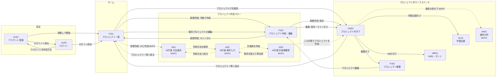

<!--
doc-type: 基本設計
id-prefix: AU, PJ, WB, SL, AN, AI, CM, SCR
related: docs/basic-design/screen-list.md, docs/requirements/details/data-screens-interfaces.md, docs/basic-design/tech-stack.md
-->

# 画面遷移図

## 1. 目的

画面間の遷移を定義し、ルーティング設計とナビゲーション設計の基準とする。

- 画面IDと画面名は `docs/basic-design/screen-list.md` に従う。
- 遷移の根拠となる画面要件は `docs/requirements/details/data-screens-interfaces.md` 16章を参照する。
- UIモックのサイドバー（全画面切り替え）は要件検証用のため、本遷移図には含めない。

## 2. 全体遷移図

CM02はプロジェクト内タブを表す図上のハブであり、独立した画面ではない。CM02からPJ03、WB01、SL01、AN01へ並列に切り替える。

ログイン後の全画面からログアウト（CM01アプリヘッダー）でAU02へ遷移できる。図の簡略化のため矢印は省略する。

## 3. 遷移一覧

| No | 遷移元 | 遷移先 | トリガー | 根拠・備考 |
| --- | --- | --- | --- | --- |
| 1 | AU01 | PJ01 | 登録して開始 | 登録成功後はログイン済み状態でホームへ |
| 2 | AU01 | AU02 | ログインへ戻る | |
| 3 | AU02 | PJ01 | ログイン成功 | PJ01はログイン後の初期画面（16.1） |
| 4 | AU02 | AU01 | アカウントを作成する | |
| 5 | PJ01 | PJ02 | 新規作成 → 手動で作成 | SCR.PJ01-12。新規作成で手動/AIを選択 |
| 6 | PJ01 | AI01 | 新規作成 → AIと作成 | MVP3。SCR.PJ01-12 |
| 7 | PJ01 | PJ03 | プロジェクト行を選択 | SCR.PJ01-06。図ではプロジェクト内タブのハブであるCM02を経由して表現する |
| 8 | PJ01 / PJ03 | PJ02 | 既存プロジェクトの編集 | SCR.PJ01-06、SCR.PJ03-04。編集モードで開く |
| 9 | PJ02 | PJ03 | 新規作成モードで保存 | SCR.PJ02-09。作成直後はWBSタスク0件。図ではCM02を経由して表現する |
| 10 | PJ02 | PJ01 | 新規作成モードでキャンセル | |
| 10A | PJ02 | PJ03 | 編集モードで保存・キャンセル | 編集元のプロジェクト概要へ戻る。図ではCM02を経由して表現する |
| 11 | AI01 | AI02 | 概要から作成 / 目次から作成を選択 | MVP3。選択した方法をAI02へ引き継ぐ |
| 12 | AI01 | PJ01 | プロジェクト一覧へ戻る | |
| 13 | AI02 | AI03 | 計画案を作成 | MVP3。必須入力を満たした場合のみ有効 |
| 14 | AI02 | AI01 | 作成方法へ戻る | 入力内容の保持は基本設計で決定 |
| 15 | AI03 | WB01 | この計画でプロジェクトを作成 | MVP3。保存後、作成されたプロジェクトのWBSへ。図ではCM02を経由して表現する |
| 16 | AI03 | AI02 | 条件を変えて再生成 | 入力条件を保持したまま戻る |
| 17 | PJ03 / WB01 / SL01 / AN01 | 相互 | CM02プロジェクト内ナビのタブ | SCR.PJ03-12、SCR.PJ03-24 |
| 18 | PJ03 / WB01 / SL01 / AN01 | PJ01 | プロジェクト一覧へ戻る | SCR.PJ03-25 |
| 19 | ログイン後の全画面 | AU02 | ログアウト（CM01） | |

## 4. 遷移の制約

| 制約 | 内容 | 根拠 |
| --- | --- | --- |
| 学習記録タブの無効化 | WBSタスクが0件のプロジェクトでは、SL01へのタブ遷移を無効（disabled）にする | SCR.WB01-09 |
| 進捗分析タブの段階提供 | AN01はMVP2で提供する。MVP1では非活性タブとして表示する | 段階リリース方針 |
| AI作成フローの段階提供 | AI01〜AI03はMVP3で提供する。MVP1・2ではPJ01の新規作成から手動作成のみ選択できる | 段階リリース方針 |
| アーカイブ済みプロジェクト | PJ03は閲覧専用となり、PJ02への編集遷移の代わりに復元操作を表示する | SCR.PJ03-05 |
| 未認証アクセス | 未ログイン状態でログイン後の画面へアクセスした場合はAU02へリダイレクトする | 認証方式の詳細は基本設計で決定 |

## 5. 画面内遷移（画面遷移としては扱わないもの）

次の操作は同一画面内の表示切り替えであり、画面遷移として扱わない。

| 画面 | 操作 | 挙動 |
| --- | --- | --- |
| WB01 | タスク選択 / 親タスクを追加 / タスクを追加 | 右サイドパネルで詳細表示・編集（SCR.WB01-07） |
| WB01 | タスク詳細から学習記録を追加 | WBS画面を維持したまま登録領域を表示（SCR.SL01-09、SCR.SL01-13） |
| SL01 | 学習記録を追加 / 一覧の行を選択 | 入力パネルを表示（SCR.SL01-11、SCR.SL01-12） |
| AI02 | こだわり条件（任意）を設定する | 折りたたみ領域の展開 |
| AI03 | 計画案のタスクを選択 | 編集パネルで直接編集・削除 |
