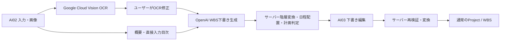

<!--
doc-type: 詳細設計
id-prefix: なし
related: docs/detailed-design/ai-plan-api.md, docs/detailed-design/database-schema.md, docs/basic-design/tech-stack.md, docs/development/wbs-generation-evaluation.md
-->

# AI学習計画生成詳細設計

## 1. 目的

Google Cloud VisionとOpenAIを利用するMVP3の処理境界、非同期状態遷移、構造化出力検証、計画矛盾判定、外部送信範囲を定義する。

## 2. 全体処理

AI出力を直接ProjectまたはWbsTaskへ保存しない。Google Cloud Visionへ送るのは画像だけとし、OpenAIへ画像を送らない。

## 3. 外部サービス境界

### 3.1 Google Cloud Vision

- `DOCUMENT_TEXT_DETECTION` を使用する。
- 画像1枚を1リクエストとして同期実行する。
- Google公式JavaクライアントのgRPC transportで画像バイト列を送信し、APIキーはクライアント設定から付与する。APIキーをURLへ含めない。
- PC Webは最大3件を並列実行する。
- 順序はクライアントの画像一時IDと配列順で管理する。
- サーバーは画像バイト列を処理完了後に破棄し、DB・ファイル・オブジェクトストレージへ保存しない。
- OCR結果の全文をログへ出力しない。
- Vision呼び出しに失敗した場合は、画像、OCR結果、APIキー、外部応答本文を含めず、アプリ内の失敗分類とgRPCステータスコードだけを運用ログへ記録する。

### 3.2 OpenAI

- Responses APIのStructured Outputsを使用する。
- Responses APIは構造化出力とストリーミングを併用できるが、MVP3ではアプリ側の停止・再開・エラー処理を単純化するため非ストリーミングで実行する。
- 具体的なモデルは設定値とし、固定評価データで品質・費用・処理時間を比較して選定する。
- WBS生成のプロンプト、JSON Schema、処理ジョブを入力・OCR処理から分離する。
- ユーザー入力とOCR結果は命令ではなくデータとして扱い、その中に含まれる指示文を実行しないことをsystem指示へ明記する。
- Structured Outputsで対応しない文字列長制約はJSON Schemaへ含めず、受信後のサーバー検証で強制する。
- API仕様の根拠はOpenAI公式の [Structured Outputs](https://platform.openai.com/docs/guides/structured-outputs) と [Responses streaming events](https://platform.openai.com/docs/api-reference/responses-streaming) を参照する。

## 4. 送信範囲

| 処理 | 送信する | 送信しない |
| --- | --- | --- |
| OCR | 教材目次画像1枚 | 認証情報、ユーザー属性、学習記録、他プロジェクト、生成条件 |
| WBS生成 | 学習目標、概要または修正済みOCR・直接入力目次、重点・軽め・除外条件、ユーザー入力の数量条件、分割単位、期間、平日・土日の学習可能時間、学習できない曜日、日程補足 | 画像、認証情報、メール、表示名、内部UUID、学習記録、他プロジェクト |

WBS生成ではユーザー入力の数量条件とサーバー算出の必要日数を数量条件の正本とする。自然文の日程補足にも同じ数量表現が残る場合は参考情報として扱い、入力済み値を上書きさせないことをプロンプト契約へ明記する。

日付`d`の利用可能時間は、学習できない曜日なら0、月曜日から金曜日なら`weekdayAvailableHours`、土曜日・日曜日なら`weekendAvailableHours`とする。祝日カレンダーは参照しない。生成前の利用可能時間0判定、生成後の日別上限工数、期限優先の警告はすべてこの値を使う。

外部サービスへ渡す一時キーは推測不能性を目的とせず、1つの生成依頼内で入力と出力の対応関係を保つための不透明な値とする。クライアント由来の一時キーを受け付ける場合も形式と重複を検証し、業務DBのUUIDは送信しない。

## 5. ジョブ状態遷移

| 現在状態 | 事象 | 次状態 | 処理 |
| --- | --- | --- | --- |
| QUEUED | worker開始 | PROCESSING | startedAtを記録 |
| QUEUED | 停止要求 | CANCELED | 外部呼び出しを開始しない |
| QUEUED | 総期限超過 | FAILED | `AI_JOB_TIMEOUT` |
| PROCESSING | 外部応答・検証成功 | COMPLETED | 結果を保存 |
| PROCESSING | 回復不能エラー | FAILED | errorCodeを保存 |
| PROCESSING | 停止要求 | CANCEL_REQUESTED | 結果保存を禁止 |
| PROCESSING | 総期限超過 | FAILED | `AI_JOB_TIMEOUT` |
| CANCEL_REQUESTED | workerが結果・停止を認識 | CANCELED | 結果を破棄 |
| CANCEL_REQUESTED | 総期限超過 | CANCELED | activeロックを解放 |

terminal状態から別状態へは遷移しない。

### 5.1 期限判定

- `deadlineAt` はジョブ受付時に設定し、queue待機時間を含む。
- 外部呼び出し単位のtimeoutと、ジョブ全体のdeadlineを分離する。
- 外部呼び出しがtimeoutになった場合は通信再試行の対象とし、最終失敗時は`AI_JOB_TIMEOUT`として「タイムアウトしたため終了した」と利用者へ通知する。
- GET status時と、新規ジョブ作成前のactiveジョブ確認時に期限切れを解消する。
- activeジョブの期限切れを解消する定期sweeperを追加する場合も、GET・作成前判定を省略しない。

### 5.2 停止と結果保存の競合

外部応答後の結果保存は1トランザクションで行う。

1. job行を悲観ロックで再取得する。
2. statusがCANCEL_REQUESTEDなら結果を保存せずCANCELEDへ更新する。
3. statusがPROCESSINGでdeadline内なら、検証済み結果を保存してCOMPLETEDへ更新する。
4. terminalなら冪等に何もしない。

停止APIの応答前後に外部処理が完了しても、停止要求中の結果が下書きとして採用されないことを保証する。

## 6. 再試行

### 6.1 通信再試行

対象:

- 接続失敗
- 外部応答の読み取り・JSON変換中に発生した通信失敗
- 外部サービスの一時的な利用不可

対象外:

- 認証・権限エラー
- 入力上限
- 安全性拒否
- JSON Schema適合後の業務制約違反
- 停止要求
- OpenAIから返る429
- Google Cloud Visionから返る認証・権限・利用上限エラー

回数とbackoffは設定値とする。deadlineを超えて再試行しない。

OpenAIから429が返った場合は、原因となるクレジット、課金、レート制限の詳細をユーザーへ公開せず、即時にFAILED `AI_GENERATION_UNAVAILABLE` とする。AI02はWBSの手動作成を案内し、「OK」押下後にPJ01へ遷移する。

Google Cloud Visionの認証・権限・利用上限エラーは自動再試行せず、503 `AI_FEATURE_UNAVAILABLE` とする。画像不正は400として同じ画像の自動再試行を行わない。`DEADLINE_EXCEEDED`、`INTERNAL`、`UNAVAILABLE` だけをVision用の回数・backoff設定に従って同期リクエスト内で再試行する。

### 6.2 構造再生成

JSON解析、Schema、参照一時キー、業務構造の検証に失敗した場合、エラー内容を外部向けに安全化して同一段階を1回だけ再生成する。再生成時は、元の入力条件と学習範囲を省略せず、指摘された構造上の問題だけを修正してWBS全体を再生成するよう指示する。2回目も失敗した場合はFAILED `AI_STRUCTURED_OUTPUT_INVALID` とし、ユーザー操作による再試行を待つ。

構造検証に失敗した場合は、入力本文、AI応答本文、例外メッセージを記録せず、ジョブID、生成回数、失敗段階、サーバー定義の固定理由コードだけをWARNログへ記録する。

## 7. WBS下書き生成

目次入力を `SECTION` で分割する場合、除外指定された範囲を除いて入力目次の全Chapterを最上位`outlineNode`として網羅し、入力後半を途中で打ち切らないようプロンプトで指示する。構造再生成時は範囲を維持し、指摘された構造だけを修正させる。

OpenAIは任意階層のアウトライン、終端項目の整数工数、入力元参照だけを提案する。予定開始日・終了日は提案させず、サーバーが利用可能時間と順序から決定する。最終版は`promptVersion = v7`、`schemaVersion = v4`、`strategyVersion = v3`とする。

`TABLE_OF_CONTENTS` かつ `SECTION` の場合は、入力行の `Chapter N`、`第N章`、`N章` という明示的な見出しから章数の概数を重複排除して算出する。下書きのPARENT数が検出章数より少ない場合は、`SOURCE_COVERAGE_MAY_BE_INCOMPLETE` を保存可能な警告として追加する。章検出は自由形式の目次を完全に解釈するものではないため、構造検証や保存可否には使用しない。

### 7.1 OpenAI出力スキーマ

- project名・概要
- 任意階層の`outlineNodes`
- ノード一時キーと親ノード一時キー
- 終端ノードの`plannedEffortHundredths`
- 終端ノードと入力元一時キーの対応
- `wbsSplitUnit`（`SECTION`, `PAGE`, `QUESTION_SET`, `AI`）

子を持つノードは分類として工数を`null`、入力元参照を空配列とする。終端ノードは実行対象として25以上999999以下かつ25の倍数の整数工数と、1件以上の入力元参照を必須とする。`25`は`0.25時間`、`125`は`1.25時間`を表す。小数の`multipleOf: 0.25`を避け、Structured Outputsの検証を整数で安定させることが目的である。

プロンプト契約では、`SECTION`なら教材の章・節、`QUESTION_SET`なら問題群・模擬試験、`AI`なら入力内容から判断した実行しやすい粒度を優先する。`PAGE`では数量条件の1日量を1実行対象のページ数の目安としてページ範囲を構成する。

### 7.2 サーバー構造検証と2階層化

- project名の必須
- 一時キーの一意性、不正親参照、自己参照、循環、親より先に現れる子を拒否する
- 子を持つノードは工数を持たず、終端ノードは整数工数と入力元参照を持つ
- 最上位分類を既存WBSのPARENTへ変換する
- 終端ノードを最上位分類配下のLEAFへ変換する
- 中間階層は`中分類 / 小分類`形式でLEAF名へ含める
- 最上位が終端ノードだけの場合はproject名から共通PARENTを1件生成する
- 終端項目が1件以上ある
- ユーザー入力の数量条件がある場合、WBS生成入力に同じ値とサーバー算出の必要日数が含まれている
- `wbsSplitUnit` が許可された列挙値であること。`PAGE`の場合は、単位がページで総量・1日量が入力済みであること
- AIが返した値を暗黙に丸めない

結合したLEAF名が100コードポイントを超える場合は、末尾側の具体的な分類を優先して先頭を`… / `へ置き換える。完全な階層パスはdescription先頭へ`階層: ...`として保持し、description全体を5,000コードポイント以内にする。名称省略時は`OUTLINE_PATH_ABBREVIATED`警告を付ける。

### 7.3 AI専用工数変換と日程配置

整数工数は`aiplan`内で`BigDecimal.valueOf(hundredths, 2)`により時間へ変換する。この内部表現変更は手動WBS、学習記録、DB制約、利用者向け0.25時間入力へ波及させない。

通常生成では、開始日から利用不可曜日を除外し、平日・土日の希望学習時間を日別上限として終端項目を順番に配置する。同日に空きがあれば次の項目を続け、目標終了日で残る工数は翌日以降の利用可能日へ配置する。期間外のLEAFは`TASK_OUTSIDE_PROJECT_PERIOD`警告付きで保存する。

期限優先では、最初に希望学習時間内で配置し、残工数を期間内の利用可能日へ負荷が低い日から均等に増やし、1日24時間まで追加する。希望時間超過は`DAILY_AVAILABLE_HOURS_EXCEEDED`警告とする。24時間まで増やしても残る工数は、目標終了日後へ通常の希望学習時間で配置する。AIが提案した総工数は増減せず、1日の実割当は24時間以下とする。

日程配置の処理量を保護するため、AI出力の総予定工数は1,000時間以下とする。超過した構造化出力は再生成対象とし、日付ごとの無制限な割当処理は行わない。

分割単位への意味的な適合はプロンプト契約と品質評価で確認し、その不一致だけを理由に下書き全体を拒否しない。構造違反は下書きとして保存しない。予定がプロジェクト期間外、日付ごとの希望学習時間を超えるなど修正可能な計画不整合は警告付き下書きとして保存できる。ただし1日24時間を超える計画は修正可能な警告ではなく、保存不可の業務制約違反とする。

## 8. 計画矛盾

### 8.1 生成前

サーバーで決定的に判定できる次の条件はAI処理前に拒否する。

- startDate > targetEndDate
- 学習内容が未入力
- 平日・土日および学習できない曜日から算出した期間全体の利用可能時間が0。平日・土日の時間が未指定の場合は、それぞれ1時間・2時間を補完して算出する
- ユーザーが構造化入力した数量条件から必要日数を算出でき、期限内の学習可能日数を超える

WBS下書き生成前に次を判定する。

- ユーザー入力の数量条件がある場合、`ceil(totalAmount / dailyAmount)` を必要日数とする
- 必要日数が期間内の学習可能日数を超える場合、AIの判断ではなくサーバー計算による矛盾として拒否する

単位の換算は行わない。たとえばページと問題数が混在する場合は1つの数量条件へ自動統合せず、ユーザーが分けて入力するよう求める。

### 8.2 生成後

WBS下書きのLEAF予定工数と利用可能時間から、次を算出する。

- 総予定工数
- 期間内の日付別希望上限工数の合計
- 不足工数
- 期限内完了に必要な1日あたり平均工数
- 学習可能日ごとの予定工数

生成直後は、サーバー日程配置が確定した日別工数を下書き内部へ保存して検証へ渡す。変換時および予定日・予定工数を変更しない更新時もこの保存済み割当を再利用する。これにより、同じ日を複数LEAFが共有しても日別24時間上限を再配分誤差なく判定し、未編集の下書きが変換時に不当に保存不可になることを防ぐ。

AI03で予定日または予定工数を編集した後は、保存済みの日別割当を使わず、次の規則で再算出して下書きへ保存し直す。

1. LEAFの予定開始日から予定終了日までを両端含みで列挙し、日付ごとの利用可能時間が0の曜日を除外する。
2. 利用可能日が0日のLEAFは保存不可とする。
3. LEAFの予定工数を利用可能日数で均等配分し、同じ日付に割り当てられた全LEAFの工数を合計する。
4. 計算途中では丸めず、表示時だけ共通工数表示ルールに従う。

この再配分は編集後の下書きがユーザー指定の学習可能曜日と24時間上限を満たすかを判定するためだけに使う。プロジェクト変換後のEVMにおけるPVは、[business-logic.md](business-logic.md) 7.1のとおり学習できない曜日を除外せず全暦日へ均等配分する。目的が異なる意図的な差異であり、どちらかの計算規則を他方へ流用しない。

生成時の日程配置は24時間を超えない。AI03編集後の再検証で日別24時間を超える場合は保存せず、`AI_DRAFT_DAILY_LIMIT_EXCEEDED` とする。期間外配置と、希望学習時間を超えるが24時間以内の配置は警告付き下書きとして保存する。それ以外の計画不整合は、構造が正しければ下書きを表示し、警告内容に直接関係する単一条件変更案だけを最大3件返す。

### 8.3 単一条件変更案

優先順:

1. 平日または土日の学習時間を必要量まで増やす
2. 期限を必要日数まで延長する
3. 学習範囲を減らす

3番目の案は具体的に自動除外せず、「学習範囲を減らす」と必要削減工数だけを示す。複数条件の組み合わせ探索は行わない。

### 8.4 期限優先

期限優先では、学習範囲と生成済み予定工数を維持する。希望時間内の配置、期限内で1日24時間までの追加配置、期限後の通常配置の順で処理し、希望時間超過と期間超過をそれぞれ警告する。

## 9. プロジェクト変換

- 変換時に下書きを再検証する。
- project、PARENT、LEAF、初期進捗履歴を1トランザクションで作成する。Project作成とWBSタスク作成は既存サービスを再利用し、初期0%進捗履歴を変換専用に実装しない。
- 下書きは1回だけ変換できる。
- 変換後は通常のProject/WbsTaskとして扱う。
- source/draft対応をProject/WbsTaskへコピーしない。
- 変換先プロジェクトを削除した場合は、`converted_project_id` をNULLにするが、`converted_at` は保持して下書きの再変換を禁止する。
- 生成依頼の入力または入力元が下書き作成後に更新された場合、その下書きの編集・変換は409 `AI_DRAFT_REGENERATION_REQUIRED` として拒否し、再生成を要求する。
- 下書き更新と変換では、構造違反および通常の業務制約違反を400 `AI_DRAFT_VALIDATION_FAILED`、1日予定工数の24時間超過を400 `AI_DRAFT_DAILY_LIMIT_EXCEEDED` として区別する。

### 9.1 一時データ削除

- `retentionExpiresAt` を過ぎた生成依頼を定期cleanup対象とする。
- activeジョブを持つ生成依頼は削除しない。
- terminalジョブだけを持つ生成依頼は、source、job、draftとともにcascade削除する。
- 変換済みプロジェクトと通常WBSは削除しない。AIデータからProject/WbsTaskへの入力元対応も残さない。
- cleanupは同じ生成依頼を複数回処理しても安全な冪等処理とし、削除件数と失敗件数だけをログへ記録する。入力本文は記録しない。
- MVP3では定期cleanup workerを実装する。単一アプリケーションインスタンスでの実行を前提とし、複数インスタンスへ拡張する場合はDBロックまたは分散ロックにより同時実行を防止する。
- 具体的な保持日数とcleanup実行間隔は運用設定とする。

## 10. 設定

次を環境別設定とする。

- Google Cloud Vision有効化、認証方式
- OpenAI有効化、API key、model
- OpenAI Responses APIの最大出力トークン数
- promptVersion, schemaVersion, strategyVersion
- 外部呼び出しtimeout
- ジョブ総deadline
- 通信再試行回数・backoff
- ユーザー別日次生成上限
- AI一時データ保持期間
- 入力文字数上限
- scheduling pool size、worker有効化、poll間隔

| 設定キー | 環境変数 | 開発時既定値 |
| --- | --- | --- |
| `app.ai.enabled` | `AI_ENABLED` | `false` |
| `app.ai.retention-days` | `AI_RETENTION_DAYS` | `30` |
| `app.ai.worker.enabled` | `AI_WORKER_ENABLED` | `true` |
| `app.ai.worker.poll-interval` | `AI_WORKER_POLL_INTERVAL` | `2s` |
| `app.ai.job-timeout` | `AI_JOB_TIMEOUT` | `5m` |
| `app.ai.daily-generation-limit` | `AI_DAILY_GENERATION_LIMIT` | `10` |
| `app.ai.openai.api-key` | `OPENAI_API_KEY` | 未設定 |
| `app.ai.openai.model` | `OPENAI_MODEL` | `gpt-4.1-mini` |
| `app.ai.openai.base-url` | `OPENAI_BASE_URL` | `https://api.openai.com` |
| `app.ai.openai.request-timeout` | `OPENAI_REQUEST_TIMEOUT` | `120s` |
| `app.ai.openai.max-output-tokens` | `OPENAI_MAX_OUTPUT_TOKENS` | `24000` |
| `app.ai.openai.communication-retries` | `OPENAI_COMMUNICATION_RETRIES` | `2` |
| `app.ai.openai.retry-backoff` | `OPENAI_RETRY_BACKOFF` | `1s` |
| `app.ai.openai.prompt-version` | なし | `v7` |
| `app.ai.openai.schema-version` | なし | `v4` |
| `app.ai.openai.strategy-version` | なし | `v3` |
| `app.ai.vision.api-key` | `GOOGLE_CLOUD_VISION_API_KEY` | 未設定 |
| `app.ai.vision.endpoint` | `GOOGLE_CLOUD_VISION_ENDPOINT` | `vision.googleapis.com:443` |
| `app.ai.vision.request-timeout` | `GOOGLE_CLOUD_VISION_REQUEST_TIMEOUT` | `60s` |
| `app.ai.vision.communication-retries` | `GOOGLE_CLOUD_VISION_COMMUNICATION_RETRIES` | `1` |
| `app.ai.vision.retry-backoff` | `GOOGLE_CLOUD_VISION_RETRY_BACKOFF` | `500ms` |
| `spring.task.scheduling.pool.size` | `SCHEDULING_POOL_SIZE` | `2` |

ユーザー別日次生成上限は、JST日付ごとに受け付けた `WBS_GENERATION` ジョブ数で判定する。通信再試行と構造再生成は同じジョブの試行として扱い、日次件数を追加消費しない。

本番でAI機能を有効にした状態で必須認証情報がない場合は起動時検証で失敗させる。AI機能を無効にした環境ではアプリを起動でき、AI APIだけを503にする。

## 11. テスト

- 通常CIはGoogle Cloud Vision、OpenAIを呼ばない。
- provider adapterのスタブと固定JSONでServiceを検証する。
- JSON Schema契約、業務検証、状態遷移、停止競合、deadline、部分一意インデックスを自動テストする。
- OpenAI応答の `status` 欠落、`incomplete`、出力トークン上限到達を固定JSONで自動テストする。
- ログ検証では学習内容、OCR結果、外部応答本文、例外メッセージに含まれる本文が記録されないことを確認する。
- ユーザー入力の数量条件とサーバー算出の必要日数がWBS生成payloadへ入り、競合する自然文の日程補足より優先されることを自動テストする。
- 通常生成と期限優先の両方で、学習可能日ごとの予定工数が24時間以下なら保存でき、24時間を超える場合は保存されないことを自動テストする。
- AI専用整数工数の値域・25刻み、1〜4階層の変換、親参照違反、100文字超過、日程配置の曜日・期間・24時間境界を自動テストする。
- OCR APIの1画像10MB上限と、生成依頼保存時の `OCR_TEXT` 最大10件を自動テストする。クライアントの画像10枚・合計50MB検証はfrontendテストで確認する。
- OCR APIのファイルシグネチャ、文字未検出、認証必須、外部エラー安全化を固定応答で自動テストする。実Vision APIの確認は環境変数で明示実行するsmoke testへ分離する。
- AI03取得レスポンスのLEAFと入力元対応が所有者制御と参照整合性を満たし、変換後の通常WBSへコピーされないことを自動テストする。
- 保持期限前、保持期限後、activeジョブあり、変換済みプロジェクトありのcleanupを自動テストする。
- 実サービスのsmoke testは明示的な手動実行とし、CI secretと課金を既定で要求しない。
- 品質比較は `docs/development/wbs-generation-evaluation.md` に従う。
