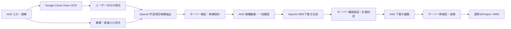

<!--
doc-type: 詳細設計
id-prefix: なし
related: docs/detailed-design/ai-plan-api.md, docs/detailed-design/database-schema.md, docs/basic-design/tech-stack.md, docs/development/wbs-generation-evaluation.md
-->

# AI学習計画生成詳細設計

## 1. 目的

Google Cloud VisionとOpenAIを利用するMVP3の処理境界、非同期状態遷移、構造化出力検証、計画矛盾判定、外部送信範囲を定義する。

## 2. 全体処理

AI出力を直接ProjectまたはWbsTaskへ保存しない。Google Cloud Visionへ送るのは画像だけとし、OpenAIへ画像を送らない。

## 3. 外部サービス境界

### 3.1 Google Cloud Vision

- `DOCUMENT_TEXT_DETECTION` を使用する。
- 画像1枚を1リクエストとして同期実行する。
- PC Webは最大3件を並列実行する。
- 順序はクライアントの画像一時IDと配列順で管理する。
- サーバーは画像バイト列を処理完了後に破棄し、DB・ファイル・オブジェクトストレージへ保存しない。
- OCR結果の全文をログへ出力しない。

### 3.2 OpenAI

- Responses APIのStructured Outputsを使用する。
- Responses APIは構造化出力とストリーミングを併用できるが、MVP3ではアプリ側の停止・再開・エラー処理を単純化するため非ストリーミングで実行する。
- 具体的なモデルは設定値とし、固定評価データで品質・費用・処理時間を比較して選定する。
- 学習項目候補抽出とWBS生成で、プロンプト、JSON Schema、処理ジョブを分離する。
- API仕様の根拠はOpenAI公式の [Structured Outputs](https://platform.openai.com/docs/guides/structured-outputs) と [Responses streaming events](https://platform.openai.com/docs/api-reference/responses-streaming) を参照する。

## 4. 送信範囲

| 処理 | 送信する | 送信しない |
| --- | --- | --- |
| OCR | 教材目次画像1枚 | 認証情報、ユーザー属性、学習記録、他プロジェクト、生成条件 |
| 候補抽出 | 学習目標、概要、修正済みOCR、直接入力目次、重点・軽め・除外条件 | 画像、認証情報、メール、表示名、内部UUID、学習記録、他プロジェクト |
| WBS生成 | 確認済み候補の一時キー・名称・説明・優先度、確認済み `normalizedPace`、サーバー算出の必要日数、期間、学習可能時間、曜日、日程補足 | 画像、OCR全文、目次全文、認証情報、ユーザー属性、学習記録、他プロジェクト |

WBS生成では確認済み `normalizedPace` とサーバー算出の必要日数を数量条件の正本とする。自然文の日程補足にも同じ数量表現が残る場合は参考情報として扱い、確認済み値を上書きさせないことをプロンプト契約へ明記する。

外部サービスへ渡す一時キーは推測不能性を目的とせず、1つの生成依頼内で入力と出力の対応関係を保つための不透明な値とする。クライアント由来の一時キーを受け付ける場合も形式と重複を検証し、業務DBのUUIDは送信しない。

## 5. ジョブ状態遷移

| 現在状態 | 事象 | 次状態 | 処理 |
| --- | --- | --- | --- |
| QUEUED | worker開始 | PROCESSING | startedAtを記録 |
| QUEUED | 停止要求 | CANCELED | 外部呼び出しを開始しない |
| QUEUED | 総期限超過 | FAILED | `AI_JOB_TIMEOUT` |
| PROCESSING | 外部応答・検証成功 | COMPLETED | 結果を保存 |
| PROCESSING | 回復不能エラー | FAILED | errorCodeを保存 |
| PROCESSING | 停止要求 | CANCEL_REQUESTED | 結果保存を禁止 |
| PROCESSING | 総期限超過 | FAILED | `AI_JOB_TIMEOUT` |
| CANCEL_REQUESTED | workerが結果・停止を認識 | CANCELED | 結果を破棄 |
| CANCEL_REQUESTED | 総期限超過 | CANCELED | activeロックを解放 |

terminal状態から別状態へは遷移しない。

### 5.1 期限判定

- `deadlineAt` はジョブ受付時に設定し、queue待機時間を含む。
- 外部呼び出し単位のtimeoutと、ジョブ全体のdeadlineを分離する。
- GET status時と、新規ジョブ作成前のactiveジョブ確認時に期限切れを解消する。
- activeジョブの期限切れを解消する定期sweeperを追加する場合も、GET・作成前判定を省略しない。

### 5.2 停止と結果保存の競合

外部応答後の結果保存は1トランザクションで行う。

1. job行を悲観ロックで再取得する。
2. statusがCANCEL_REQUESTEDなら結果を保存せずCANCELEDへ更新する。
3. statusがPROCESSINGでdeadline内なら、検証済み結果を保存してCOMPLETEDへ更新する。
4. terminalなら冪等に何もしない。

停止APIの応答前後に外部処理が完了しても、停止要求中の結果が候補または下書きとして採用されないことを保証する。

## 6. 再試行

### 6.1 通信再試行

対象:

- 接続失敗
- 429
- 一時的な5xx

対象外:

- 認証・権限エラー
- 入力上限
- 安全性拒否
- JSON Schema適合後の業務制約違反
- 停止要求

回数とbackoffは設定値とする。deadlineを超えて再試行しない。

### 6.2 構造再生成

JSON解析、Schema、参照一時キー、業務構造の検証に失敗した場合、エラー内容を外部向けに安全化して同一段階を1回だけ再生成する。2回目も失敗した場合はFAILED `AI_STRUCTURED_OUTPUT_INVALID` とし、ユーザー操作による再試行を待つ。

## 7. 学習項目候補抽出

### 7.1 出力スキーマ

各候補は次を必須とする。

- `temporaryKey`
- `name`
- `description`
- `originType`
- `priority`
- `sourceTemporaryKeys`

`originType` は `INPUT_DERIVED` または `AI_SUPPLEMENTED`、`priority` は `FOCUS`, `NORMAL`, `LIGHT`, `EXCLUDED` に限定する。

候補一覧と別に次を返す。

- `normalizedPace`: 数量条件がない場合はnull。ある場合は `unitLabel`, `totalAmount`, `dailyAmount`, `evidenceText`, `sourceTemporaryKeys`
- `unresolvedConstraints`: 数量条件らしい記述を構造化できなかった場合の短い説明と根拠

### 7.2 検証

- nameは1〜100文字
- temporaryKeyはレスポンス内で一意
- INPUT_DERIVEDは存在するsourceTemporaryKeyを1件以上参照
- AI_SUPPLEMENTEDはsource参照なしを許可
- 同一名称だけで自動統合しない
- 空候補一覧は失敗
- normalizedPaceの数量は正数とし、参照sourceとevidenceTextが存在する
- unresolvedConstraintsは外部サービスの生レスポンスを含めない

概要だけの入力ではAI補足を許可する。目次入力がある場合も補足は許可するが、由来を必ず区別する。

normalizedPaceとunresolvedConstraintsは候補一覧のrevisionに含める。ユーザーがAI03で修正した場合はcandidateRevisionを進め、候補一覧と同じ一括確認の対象とする。

## 8. WBS下書き生成

### 8.1 出力スキーマ

- project候補
- PARENT/LEAFのtask一覧
- task一時キー
- parent一時キー
- LEAFの予定日、予定工数
- LEAFと候補一時キーの多対多対応

### 8.2 サーバー検証

- project名、開始日、終了日の必須
- WBS最大2階層
- PARENTは最上位で、予定日・工数を持たない
- LEAFの予定工数は0.25h以上かつ0.25h単位
- LEAFの開始日 <= 終了日
- 親参照と候補参照が存在する
- 除外候補を参照しない
- 除外されていない候補が少なくとも1件のLEAFに対応する
- 確認済みnormalizedPaceがある場合、WBS生成入力に同じ値とサーバー算出の必要日数が含まれている
- AIが返した値を暗黙に丸めない
- 3階層以上を暗黙に平坦化しない

構造違反は下書きとして保存しない。予定がプロジェクト期間外、希望学習時間を超えるなど修正可能な計画不整合は警告付き下書きとして保存できる。ただし1日24時間を超える計画は修正可能な警告ではなく、保存不可の業務制約違反とする。

## 9. 計画矛盾

### 9.1 生成前

サーバーで決定的に判定できる次の条件はAI処理前に拒否する。

- startDate > targetEndDate
- 除外されていない候補が0件
- 利用可能曜日・時間から期間全体の利用可能時間が0
- ユーザーが構造化入力した数量条件から必要日数を算出でき、期限内の学習可能日数を超える
- 指定された1日あたり必要時間が24時間を超える

候補抽出後、WBS下書き生成前に次を判定する。

- unresolvedConstraintsが1件以上なら、AI03での修正を要求する
- normalizedPaceがある場合、`ceil(totalAmount / dailyAmount)` を必要日数とする
- 必要日数が期間内の学習可能日数を超える場合、AIの判断ではなくサーバー計算による矛盾として拒否する

単位の換算は行わない。たとえばページと問題数が混在する場合は1つの数量条件へ自動統合せず、解釈不能としてユーザーの修正を求める。

### 9.2 生成後

WBS下書きのLEAF予定工数と利用可能時間から、次を算出する。

- 総予定工数
- 期間内の希望上限工数
- 不足工数
- 期限内完了に必要な1日あたり平均工数
- 学習可能日ごとの予定工数

学習可能日ごとの予定工数は次の規則で算出する。

1. LEAFの予定開始日から予定終了日までを両端含みで列挙し、学習できない曜日を除外する。
2. 利用可能日が0日のLEAFは保存不可とする。
3. LEAFの予定工数を利用可能日数で均等配分し、同じ日付に割り当てられた全LEAFの工数を合計する。
4. 計算途中では丸めず、表示時だけ共通工数表示ルールに従う。

この配分は、AI下書きがユーザー指定の学習可能曜日と24時間上限を満たすかを判定するためだけに使う。プロジェクト変換後のEVMにおけるPVは、[business-logic.md](business-logic.md) 7.1のとおり学習できない曜日を除外せず全暦日へ均等配分する。目的が異なる意図的な差異であり、どちらかの計算規則を他方へ流用しない。

通常生成と期限優先のどちらでも、学習可能日ごとの予定工数が24時間を超える場合は下書きを保存せず `AI_DRAFT_VALIDATION_FAILED` とする。それ以外の計画不整合は、構造が正しければ下書きを表示し、警告と最大3件の単一条件変更案を返す。

### 9.3 単一条件変更案

優先順:

1. 1日あたり学習時間を必要量まで増やす
2. 期限を必要日数まで延長する
3. 除外候補を追加する

候補3は具体的に自動除外せず、「学習範囲を減らす」と必要削減工数だけを示す。複数条件の組み合わせ探索は行わない。

### 9.4 期限優先

期限優先では、除外されていない確認済み候補と生成済み予定工数を維持する。共通の24時間上限を満たす範囲で、希望する1日あたり学習時間を超えても計画するが、必要量を警告する。

## 10. プロジェクト変換

- 変換時に下書きを再検証する。
- project、PARENT、LEAF、初期進捗履歴を1トランザクションで作成する。
- 下書きは1回だけ変換できる。
- 変換後は通常のProject/WbsTaskとして扱う。
- candidate/source/draft対応をProject/WbsTaskへコピーしない。

### 10.1 一時データ削除

- `retentionExpiresAt` を過ぎた生成依頼を定期cleanup対象とする。
- activeジョブを持つ生成依頼は削除しない。
- terminalジョブだけを持つ生成依頼は、source、candidate、candidate-source対応、job、draft、draft-candidate対応とともにcascade削除する。
- 変換済みプロジェクトと通常WBSは削除しない。AIデータからProject/WbsTaskへの候補対応も残さない。
- cleanupは同じ生成依頼を複数回処理しても安全な冪等処理とし、削除件数と失敗件数だけをログへ記録する。入力本文は記録しない。
- MVP3では定期cleanup workerを実装する。単一アプリケーションインスタンスでの実行を前提とし、複数インスタンスへ拡張する場合はDBロックまたは分散ロックにより同時実行を防止する。
- 具体的な保持日数とcleanup実行間隔は運用設定とする。

## 11. 設定

次を環境別設定とする。

- Google Cloud Vision有効化、認証方式
- OpenAI有効化、API key、model
- promptVersion, schemaVersion, strategyVersion
- 外部呼び出しtimeout
- ジョブ総deadline
- 通信再試行回数・backoff
- ユーザー別日次生成上限
- AI一時データ保持期間
- 入力文字数上限

ユーザー別日次生成上限は、JST日付ごとに受け付けた `LEARNING_ITEM_EXTRACTION` と `WBS_GENERATION` のジョブ数を合計して判定する。通信再試行と構造再生成は同じジョブの試行として扱い、日次件数を追加消費しない。

本番でAI機能を有効にした状態で必須認証情報がない場合は起動時検証で失敗させる。AI機能を無効にした環境ではアプリを起動でき、AI APIだけを503にする。

## 12. テスト

- 通常CIはGoogle Cloud Vision、OpenAIを呼ばない。
- provider adapterのスタブと固定JSONでServiceを検証する。
- JSON Schema契約、業務検証、状態遷移、停止競合、deadline、部分一意インデックスを自動テストする。
- AI03で修正した `normalizedPace` とサーバー算出の必要日数がWBS生成payloadへ入り、競合する自然文の日程補足より優先されることを自動テストする。
- 通常生成と期限優先の両方で、学習可能日ごとの予定工数が24時間以下なら保存でき、24時間を超える場合は保存されないことを自動テストする。
- OCR APIの1画像10MB上限と、生成依頼保存時の `OCR_TEXT` 最大10件を自動テストする。クライアントの画像10枚・合計50MB検証はfrontendテストで確認する。
- AI04取得レスポンスのLEAFと候補対応が所有者制御と参照整合性を満たし、変換後の通常WBSへコピーされないことを自動テストする。
- 保持期限前、保持期限後、activeジョブあり、変換済みプロジェクトありのcleanupを自動テストする。
- 実サービスのsmoke testは明示的な手動実行とし、CI secretと課金を既定で要求しない。
- 品質比較は `docs/development/wbs-generation-evaluation.md` に従う。
